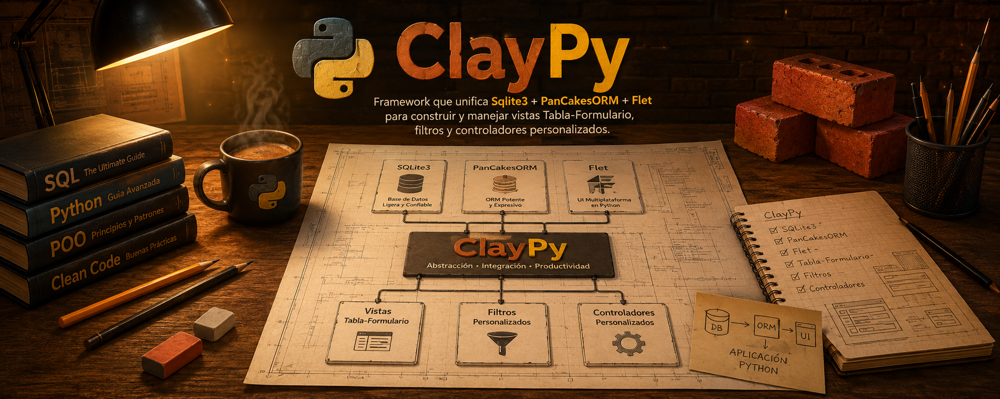

# 🔥 ClayPy _[PanCakesORM]() & [Flet]()_ Framework para ERP's



A traves de _ClayPy_ es posible el desarrollo de paquetes SQL -> LOGICA -> FLET a traves de el acomplamiento y desacoplamiento de modulos almacenados en el directorio packages.

## 🏗️ Jerarquía de directorios

```txt
.
└── ClayPy/
    ├── framework/
    │   └── package_loader.py
    ├── packages/
    │   └── inventory/
    │       └── __manifest__.py
    ├── requirements/
    ├── app_shell/
    ├── .gitignore
    ├── app.py
    └── README.md
``` 